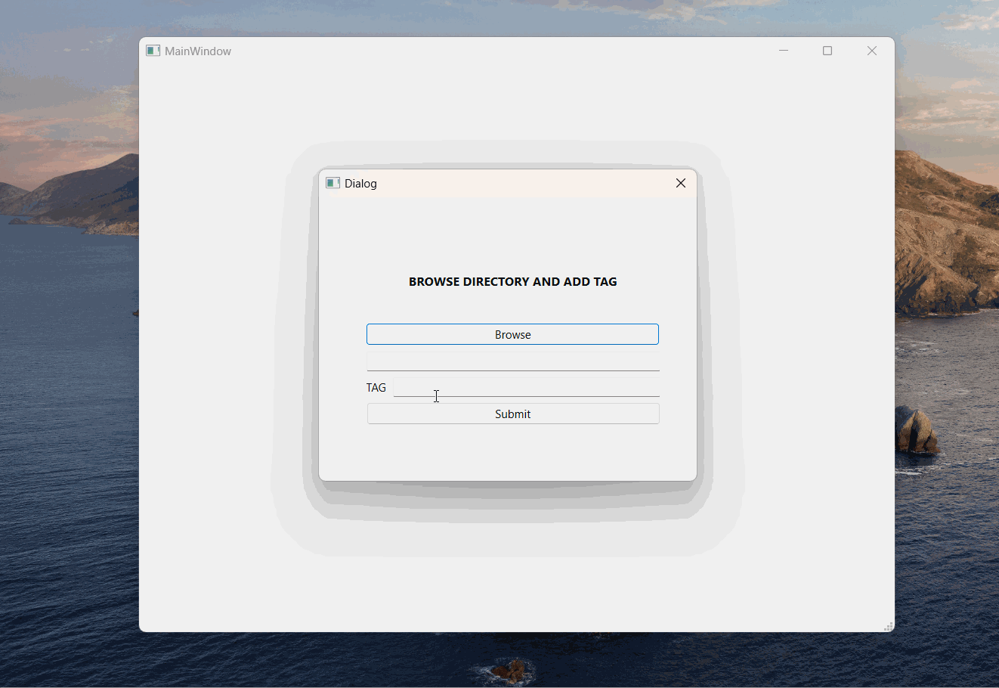
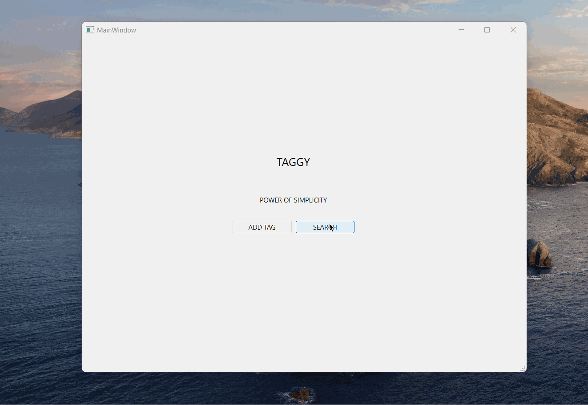

# Taggy

- Taggy is a file tagging system developed using C++ and QT Creator.
- It provides a convenient way to tag files with custom labels or categories, making it easier to organize and search for files based on their tags.
- <a href="https://github.com/Akshit1903/TaggyDeployment">Deployment</a>
- <a href="https://youtu.be/maRVWniys08">YouTube</a>

## Tutorials:

### Add Tags:

- Consider two files file1.txt and file2.txt.
- We add the tags `academics` and `maths` to file1.txt and `maths` to file2.txt.

  

### Search:

- We search for the tag `maths`

  

## Features

- File Tagging: Users can assign tags to files, allowing for easy categorization and organization.
- Custom Tag Creation: Users can create their own tags or categories to suit their organizational needs.
- Tag Search: The application provides a search functionality to quickly locate files based on their assigned tags.
- User-Friendly Interface: The intuitive and user-friendly interface of Taggy makes it simple to manage file tags.

## Technologies Used

- C++: The programming language used to develop the core functionalities of Taggy.
- QT Creator: The integrated development environment (IDE) utilized for building the graphical user interface (GUI) of the application.

## Installation

Note:- Refer to <a href="https://github.com/Akshit1903/TaggyDeployment">Deployment</a> repository for direct testing purposes.

1. Clone the repository:

```shell
    git clone https://github.com/Akshit1903/Taggy
```

2. Open the project in QT Creator.Note:- In order to run the project, add all the source,header and UI files to QT creator.
3. Build the project using the QT Creator build options in release mode.
4. Locate the binary for the project and place it in desired folder. In our case, it is `fromScratch.exe`.
5. Add `C:\q_open_source\Qt\{your_version}\mingw_64\bin` to user environment variables.
6. Run the following command in the directory where the binary is placed

```shell
    windeployqt -h
    windeployqt fromScratch.exe
```

## Usage

1. Launch the Taggy application.
2. Select the files or directories you want to tag.
3. Create custom tags or select from existing tags.
4. Assign the selected tags to the chosen files or directories.
5. Use the search functionality to find files based on their tags.

## Logic

- Two files are created during the lifecycle of the app:
  - `fileTags.b`:
    - Path: `C:\Users\%USERNAME\Documents\fileTags.b`
    - For storing tags to file mapping
  - `tags.b`:
    - Path: The directory where the file is stored
    - For storing files to tag mapping
- The mapping is loaded into memory using C++ STL.

## Future Scope

- Handling edge cases with query operations of AND,OR etc.
- Option to edit, delete tags etc.

Happy tagging with Taggy!
